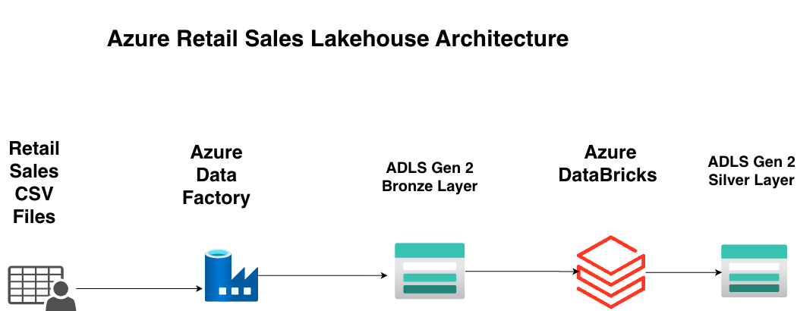

# Azure Retail Sales Lakehouse

End-to-end Azure Data Engineering project implementing a Retail Sales Lakehouse using Azure Data Factory, Azure Data Lake Storage Gen2 (ADLS Gen2), Azure Databricks, PySpark, and SQL. The project features a metadata-driven ingestion framework based on the Medallion Architecture (Bronze, Silver, Gold).

# Project Architecture

  

## ⭐ Current Warehouse Model

Fact Table
- fact_sales

Dimensions
- dim_customer
- dim_product
- dim_store
- dim_date
Architecture: Star Schema built on Medallion Architecture.

## 🛠️ Tech Stack

* **Cloud Platform:** Microsoft Azure
* **Storage:** Azure Data Lake Storage Gen2 (ADLS Gen2)
* **Data Integration:** Azure Data Factory
* **Processing:** Azure Databricks
* **Languages:** PySpark, SQL
* **Architecture:** Medallion Architecture (Bronze, Silver, Gold)
* **File Formats:** CSV, Parquet

## 📌 Project Progress

| Sprint | Status |
|---------|--------|
| Sprint 1 – Metadata Driven Ingestion | ✅ Completed |
| Sprint 2 – Incremental Loading | ✅ Completed |
| Sprint 3 – Metadata & Watermark Framework | ✅ Completed |
| Sprint 4 – Bronze → Silver Transformation | ✅ Completed |
| Sprint 5 – Silver → Gold Transformation | ✅ Completed |
| Sprint 6 – Delta Lake & Unity Catalog |✅ Completed |

## 🚀 Sprint 1 - Metadata-Driven Ingestion ✅

* Created Azure Data Lake Storage Gen2 with Bronze, Silver, and Gold containers.
* Designed a realistic retail sales dataset consisting of Customers, Products, Stores, Sales, and a metadata configuration file.
* Developed a metadata-driven Azure Data Factory pipeline using:

  * Lookup Activity
  * ForEach Activity
  * Parameterized Datasets
  * Copy Activity
* Successfully ingested Bronze CSV files into the Silver layer as Parquet files.

## 🚀 Sprint 2 - Pipeline Control ✅

* Implemented metadata-based file activation using the `Is_Active` flag.
* Added an If Condition activity to dynamically control file ingestion.
* Verified that inactive datasets are skipped without modifying the pipeline.

  
## 🚀 Sprint 3 – Azure SQL Metadata Framework

### Features Implemented

* Created Azure SQL Server and Azure SQL Database.
* Designed `watermark_metadata` table for runtime metadata.
* Configured Azure SQL Linked Service and Dataset in ADF.
* Implemented dynamic watermark lookup using Lookup Activity.
* Refactored the pipeline into a Parent–Child architecture using Execute Pipeline activity.

  
## 🚀 Sprint 4 – Bronze to Silver Transformation

### Objective

Transform raw Bronze datasets into clean, validated, and analytics-ready Silver datasets using PySpark in Azure Databricks.

### Customers

- Applied explicit schema and performed data profiling.
- Implemented business rule validations and data standardization.
- Validated schema, row count, null values, duplicates, and sample records.
- Successfully published the cleansed dataset to the Silver layer.

### Products

- Applied explicit schema and performed data profiling.
- Implemented business rule validations for product attributes and pricing.
- Standardized text fields and validated data quality.
- Successfully published the cleansed dataset to the Silver layer.

### Stores

- Applied explicit schema and performed data profiling.
- Validated mandatory fields, employee count, and opening dates.
- Performed schema, row count, null, duplicate, and sample data validations.
- Successfully published the cleansed dataset to the Silver layer.

### Sales

- Applied explicit schema and comprehensive data quality validations.
- Validated mandatory fields, numeric values, dates, payment methods, and order status.
- Performed referential integrity validation against Customer, Product, and Store datasets.
- Derived business attributes:
  - `Gross_Price`
  - `Final_Price`
- Successfully published the cleansed dataset to the Silver layer.

### Outcome

- All four Silver datasets were successfully created and validated with no data loss.

  
## 🚀 Sprint 5 – Gold layer

Developed `dim_customer`, `dim_product`, and `dim_store` with comprehensive data quality validations. Added `Price_Category` to `dim_product` using quartile-based business classification and successfully published all dimensions to the Gold layer.

### Date Dimension

- Generated a complete calendar and derived analytical attributes including `Date_Key`, Year, Quarter, Month, Week, Day, and `Is_Weekend`.

### Gold Fact Table

- Developed the `fact_sales` table from the Silver Sales dataset.
- Validated schema, row count, null values, duplicates, business rules, and referential integrity.
- Derived analytical attributes:
  - Date_Key
  - Discount_Percentage
  - Discount_Flag
- Successfully published the Gold Fact table to the Gold layer.

## Sprint 6 – Delta Lake & Unity Catalog

- Converted all Gold layer Parquet datasets to Delta Lake format.
- Created a dedicated gold-delta ADLS container to store Delta tables.
- Validated each migration by verifying:
- Delta storage structure (_delta_log)
- Row counts
- Schema consistency
- Sample records
- Created a Gold schema in Unity Catalog.
- Registered all Delta datasets as External Tables:
- dim_customer
- dim_date
- dim_product
- dim_store
- fact_sales
- Verified successful registration using SQL queries.
- Prepared the serving layer for downstream analytics and Power BI consumption.

 ### Current Project Status

- ✅ Metadata-Driven Ingestion
- ✅ Bronze Layer
- ✅ Silver Layer
- ✅ Gold Layer
- ✅ Delta Migration & Unity Catalog Registration
