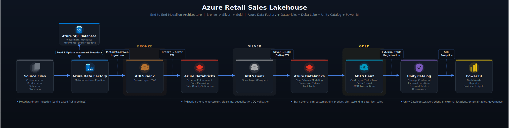

# Azure Retail Sales Lakehouse

End-to-end Azure Data Engineering project implementing a **Retail Sales Lakehouse** on the **Medallion Architecture** (Bronze → Silver → Gold), built with Azure Data Factory, Azure Data Lake Storage Gen2, Azure Databricks, PySpark, Delta Lake, and Unity Catalog.

The pipeline ingests four retail source files through a metadata-driven ADF framework, applies schema enforcement and data-quality validation in PySpark, and publishes a **star schema** to a governed Gold layer, ready for BI consumption.

**Why this design:**
- **Medallion Architecture** separates raw ingestion (Bronze), validated and cleansed data (Silver), and analytics-ready data (Gold), giving each layer a clear responsibility while making data quality issues easier to isolate and troubleshoot.
- **Metadata-driven ingestion** uses a configuration file to drive a parameterized Azure Data Factory pipeline (Lookup → ForEach → Copy), allowing new source tables to be onboarded through configuration rather than pipeline development.
- **Delta Lake in the Gold layer** provides ACID transactions, schema enforcement, and time travel, making the analytics layer more reliable and production-ready for BI workloads.
- **Unity Catalog external tables** separate data governance from physical storage, enabling secure, governed access for Power BI and other consumers without exposing raw storage paths.

---

## ⭐ Project Highlights

- Metadata-driven Azure Data Factory pipeline for configurable ingestion
- End-to-end Medallion Architecture (Bronze → Silver → Gold)
- Incremental loading using watermark-based processing
- Data quality validation with rejected records and auditability
- Star schema with dimension and fact tables
- Delta Lake implementation with Unity Catalog governance
- Power BI-ready Gold layer for analytics

---

## 🏗️ Project Architecture

<p align="center">
  
</p>

## 📁 Repository Structure

```
├── Architecture/
│   ├── Project_Architecture.svg
│   └── azure_lakehouse_architecture.png
│
├── ADF components/                  # Azure Data Factory pipelines, datasets & linked services
│   ├── Datasets/
│   ├── Linked Services/
│   └── Pipelines/
│
├── Azure Components/                # Azure resources and implementation screenshots
│   ├── ADLS Gen2/
│   ├── Azure Data Factory/
│   ├── Azure SQL/
│   └── Databricks Unity Catalog/
│
├── Dashboard Screenshots/           # Power BI dashboard and semantic model
│   ├── Executive Summary Dashboard
│   ├── Detailed Analysis Dashboard
│   └── Power BI Semantic Model
│
├── Databricks/                      # PySpark notebooks and Unity Catalog SQL
│   ├── Silver_Notebooks/
│   │   ├── 01-Customers-Bronze-to-Silver
│   │   ├── 02-Products-Bronze-to-Silver
│   │   ├── 03-Stores-Bronze-to-Silver
│   │   └── 04-Sales-Bronze-to-Silver_Final
│   │
│   ├── Gold_Parquet_Notebooks/
│   │   ├── 05-Date-Dimension-Silver-to-Gold
│   │   ├── 06-Customer-Dimension-Silver-to-Gold
│   │   ├── 07-Store-Dimension-Silver-to-Gold
│   │   ├── 08-Product-Dimension-Silver-to-Gold
│   │   └── 09-Fact-Sales-Silver-to-Gold_Final
│   │
│   ├── Gold_Delta_Notebooks/
│   │   ├── 10-delta-dim-date
│   │   ├── 11-delta-dim-customers
│   │   ├── 12-delta-dim-products
│   │   ├── 13-delta-dim-stores
│   │   └── 14-delta-fact-sales
│   │
│   └── SQL/
│       └── Unity Catalog external table registration scripts
│
└── README.md
```


---

## ⭐ Warehouse Model — Star Schema

**Fact Table**
- `fact_sales` — 72,445 rows, line-item grain (one row = one product line within a customer order)

**Dimensions**
- `dim_customer` — 5,000 rows
- `dim_product` — 1,000 rows
- `dim_store` — 25 rows
- `dim_date` — 546 rows (2025-01-01 → 2026-06-30, generated from the actual Sale_DateTime range in the Sales dataset)

All four dimension keys were validated with zero orphaned foreign keys in `fact_sales` before publishing to Gold.

---


## 🛠️ Tech Stack

* **Cloud Platform:** Microsoft Azure
* **Storage:** Azure Data Lake Storage Gen2 (ADLS Gen2)
* **Data Integration:** Azure Data Factory
* **Processing:** Azure Databricks
* **Languages:** PySpark, SQL
* **Architecture:** Medallion Architecture (Bronze, Silver, Gold) + Star Schema
* **Storage Formats:** CSV (Bronze), Parquet (Silver and initial Gold implementation), Delta Lake (refactored Gold implementation)
* **Governance:** Unity Catalog (external tables, storage credentials, external locations)

---

## 📌 Project Progress

| Sprint | Focus | Status |
|---|---|---|
| Sprint 1 | Metadata-Driven Ingestion | ✅ Completed |
| Sprint 2 | Pipeline Control (Incremental Loading) | ✅ Completed |
| Sprint 3 | Azure SQL Metadata & Watermark Framework | ✅ Completed |
| Sprint 4 | Bronze → Silver Transformation | ✅ Completed |
| Sprint 5 | Silver → Gold Transformation | ✅ Completed |
| Sprint 6 | Delta Lake & Unity Catalog | ✅ Completed |
| Sprint 7 | Power BI Dashboard & Analytics | ✅ Completed |
---


## 🚀 Sprint 1 – Metadata-Driven Ingestion ✅

* Created ADLS Gen2 with Bronze, Silver, and Gold containers.
* Designed a realistic retail dataset: Customers, Products, Stores, Sales, plus a metadata configuration file.
* Built a metadata-driven ADF pipeline using Lookup, ForEach, parameterized datasets, and Copy activities.
* Ingested Bronze CSVs into ADLS Gen2 as the landing layer.


## 🚀 Sprint 2 – Pipeline Control ✅

* Implemented metadata-based file activation using an `Is_Active` flag.
* Added an If Condition activity to dynamically include/skip datasets per run.
* Verified inactive datasets are skipped without modifying the pipeline itself.

  
* Metadata Table

- Source file
- Source folder
- Target folder
- Target filename
- Target format
- Load type
- Is_Active flag


**ADF Orchestration**

Parent Pipeline
    ↓
Lookup
    ↓
ForEach
    ↓
Child Pipeline
    ↓
Incremental / Full Load


## 🚀 Sprint 3 – Azure SQL Metadata & Watermark Framework ✅

* Created Azure SQL Server/Database and a `watermark_metadata` table for runtime metadata.
* Configured the Azure SQL linked service and dataset in ADF.
* Implemented dynamic watermark lookups for incremental loading.
* Refactored the pipeline into a Parent–Child architecture using Execute Pipeline.
* The parent pipeline orchestrates downstream Databricks transformations by invoking a Databricks Job Activity,
  separating pipeline orchestration from notebook execution.
 
  
## 🚀 Sprint 4 – Bronze → Silver Transformation ✅

Transformed raw Bronze CSVs into validated, analytics-ready Silver Parquet datasets using PySpark on Databricks. Each dataset was schema-enforced, profiled, and validated against explicit business rules before being published.

| Dataset | Raw Rows | Silver Rows | Key Validations | Result |
|---|---|---|---|---|
| **Customers** | 5,000 | 5,000 | ID/name/segment not null, email format, registration date ≤ today, duplicate check | No dupes; 63 rows with null email retained (no business rule required rejection) |
| **Products** | 1,000 | 1,000 | ID not null, price/launch date sanity, duplicate check | No dupes; 14 rows with null `Product_Brand` retained (no reference data to impute) |
| **Stores** | 25 | 25 | All fields not null, duplicate check | Clean — 0 nulls, 0 duplicates |
| **Sales** | 75,635 | 72,445 | Dedup, mandatory fields, numeric sanity, date sanity, 3× referential integrity, domain validation | 3,190 records rejected across 6 gates (funnel below) |

**Sales data-quality funnel** (the most complex transformation in the project):

| Stage | Rows In | Rejected | Rows Out | Reason |
|---|---|---|---|---|
| Raw | 75,635 | — | 75,635 | Source file |
| Dedup on `Sale_ID` | 75,635 | 500 | 75,135 | Exact duplicate line items |
| Mandatory field check | 75,135 | 769 | 74,366 | All missing `Payment_Method` |
| Numeric validation | 74,366 | 774 | 73,592 | `Quantity ≤ 0` (negative quantity, e.g. `-1`) |
| Date validation | 73,592 | 0 | 73,592 | All `Sale_DateTime` ≤ current timestamp |
| Customer FK integrity | 73,592 | 783 | 72,809 | Orphaned `Customer_ID` (sentinel `C99999`) |
| Product FK integrity | 72,809 | 364 | 72,445 | Orphaned `Product_ID` (sentinel `P9999`) |
| Store FK integrity | 72,445 | 0 | 72,445 | Clean |
| Domain validation | 72,445 | 0 | 72,445 | `Payment_Method` / `Order_Status` enums clean |
| **Final Silver output** | | **3,190 total rejected (4.2%)** | **72,445** | Enriched with `Gross_Price`, `Final_Price` |

**Note:** The synthetic retail dataset intentionally includes invalid records (duplicates, orphaned foreign keys, missing mandatory values, and invalid numeric values) to validate the data-quality framework. Rejected records demonstrate rule enforcement and auditability rather than unexpected production data loss.

  
## 🚀 Sprint 5 – Silver → Gold Transformation ✅

* `dim_customer`, `dim_store` — pass-through from Silver, re-validated (5,000 / 25 rows, 0 dupes).
* `dim_product` — added `Price_Category` via quartile-based classification on `Product_Price` (Budget/Standard/Premium/Luxury, 250 products each).
* `dim_date` — generated dynamically from the minimum and maximum `Sale_DateTime` values in the Sales dataset (546 days). This guarantees complete date coverage for the fact table while avoiding unnecessary future dates. validated schema, duplicates, and referential integrity against Customer, Product, and Store dimensions (zero orphaned keys).
* Date coverage was inherently guaranteed because `dim_date` was generated directly from the Sales date range.
* `fact_sales` — built from Silver Sales (72,445 rows); validated schema, duplicates, and referential integrity against all four dimensions (**zero orphaned keys**). Derived `Date_Key`, `Discount_Percentage`, and `Discount_Flag` (72,162 discounted / 283 non-discounted transactions).


## 🚀 Sprint 6 – Delta Lake & Unity Catalog ✅

* Converted all 5 Gold Parquet datasets to Delta format in a dedicated `gold-delta` ADLS container.
* Validated each migration: `_delta_log` structure present, row counts matched source Parquet exactly, schema consistent, sample records spot-checked.
* Registered all 5 Delta tables as **external tables** in a Unity Catalog(adb_retail_lakeshouse_dev) schema(gold):
  - `dim_customer`, `dim_date`, `dim_product`, `dim_store`, `fact_sales`
* Verified registration via `SHOW EXTERNAL LOCATIONS` and `SELECT` queries against the catalog.
* Serving layer is ready for Power BI / downstream analytics consumption.

---

### Sprint 7 – Power BI Dashboard & Analytics

**Objective:** Build an interactive business intelligence dashboard on top of the curated Gold layer to demonstrate end-to-end analytics.

**Key Deliverables:**
- Connected Power BI to the curated Gold layer.
- Built a star schema-based semantic model using fact and dimension tables.
- Created DAX measures for key business KPIs.
- Designed an interactive dashboard with slicers, filters, and drill-down capabilities.
- Developed business-focused visualizations for sales performance, customer insights, product analysis, and store performance.
- Optimized the report model for usability and analytical exploration.

## Business KPIs

The Power BI semantic model includes:

- Total Sales
- Total Orders
- Average Order Value
- Total Customers
- Total Quantity Sold
- Total Discount

**Executive Dashboard**
  <p align="center">
  
</p>

**Detailed Summary Dashboard**
  <p align="center">
  
</p>


**Outcome:**
- Successfully completed an end-to-end Azure Data Engineering solution, from data ingestion through transformation, governance, and business intelligence reporting.
  
- Power BI Dashboard built on

- 72,445 fact rows
- 5 dimensions
- 30K Orders
- 5.42 Billion Sales revenue( in INR)

---

## 💡 Key Challenges & Engineering Decisions

**1. Floating-point precision false-positives in business rule validation.**
A rule checking `Quantity × Unit_Price = Gross_Price` initially flagged 8,666 records as invalid — nearly 12% of the dataset. Investigation showed the calculated and stored values were visually identical; the mismatch came from `double`-type binary rounding, not a real data error. Rounding both sides to 2 decimal places before comparison resolved all 8,666 false positives (0 real mismatches remained). This is a good example of why a failing validation should always be root-caused before rejecting data.

**2. Planted bad data for referential integrity testing.**
The Sales dataset included intentional sentinel values (`Customer_ID = C99999`, `Product_ID = P9999`) that don't exist in any dimension. Building the FK validation as anti-join / semi-join pairs against each dimension caught these deterministically (783 and 364 rows respectively) — a pattern that generalizes cleanly to any number of dimensions.

**3. Full accountability for every rejected record.**
Rather than a single blanket "clean the data" step, Sales runs through 6 sequential, independently-counted gates (dedup → mandatory fields → numeric → 3× FK integrity → domain). Every one of the 3,190 rejected records is attributable to a specific, named rule — important for debugging and for explaining data loss to stakeholders.

**4. Incremental evolution of the Gold layer from Parquet to Delta Lake.**
The Gold layer was initially implemented using Parquet to validate the complete Medallion Architecture, star schema design, and business transformations before introducing additional platform capabilities. Once the end-to-end pipeline and Gold model were verified, the implementation was deliberately refactored to Delta Lake to gain ACID transactions, schema enforcement, and Unity Catalog integration for governed data access. The original Parquet implementation is retained in the repository as a reference to the project's learning progression and engineering evolution, while the Delta Lake implementation represents the current active Gold serving layer used for downstream analytics.

---
